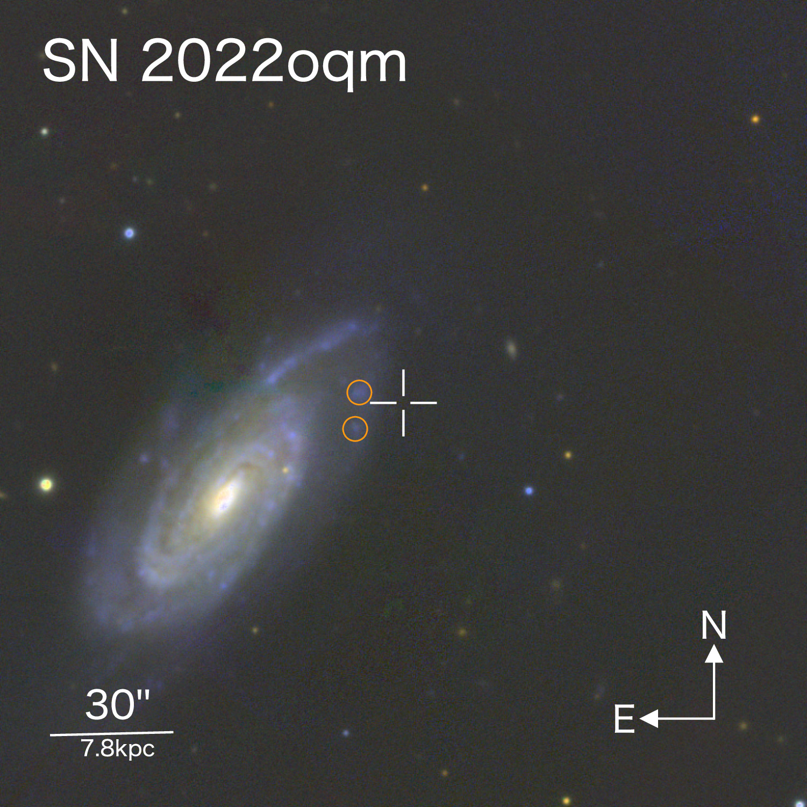

# Research Interests

## Stripped Envelope Supernova Light Curves

My main research focus is on a type of supernova called “Stripped Envelope Supernovae”. These are caused by the collapse of the core of a massive star. However, if that star has lost its outer layers, called stripping, the resulting supernova is a "stripped envelope supernova". These supernovae have a large diversity in how they are produced, and in the types of stars that can create them. We can understand how they work by studying how the total amount of light they emit changes over time (called the photometry, or the “light curve” of the object) and by studying how bright the object is in each wavelength (called the spectrum or the “Spectral Energy Distribution” of the object). Some core-collapse supernovae can be much, much brighter than all the others, called supeluminous supernovae ([SLSN](https://astrobites.org/2016/12/02/classifying-supernovae/)). 

Many of these supernovae are thought to be powered by the radioactive decay of Nickel-56. After light emitted from that radioactive decay slowly moves through the thick ejecta launched from the supernova, it is finally released into the surroundings of the star, and becomes visible to the rest of the universe, powering the light curve. As such, this light curve can tell a lot about both the mass of Nickel-56 originally present in the supernova, and about the composition of the ejecta. You can read my [bite](https://astrobites.org/2024/10/04/how-to-power-supernovae/) to learn about the power sources of many supernovae!

## Using AI to Learn Physics
In order to learn about the composition and energetics of a supernova, I need to first understand the intricate influence between the light detected from the supernova and the composition of the ejecta. Specifically, I need to simulate light traveling through supernova ejecta, and then connect the resulting light curve of this travel path to the specific combination of energetics and composition of the supernova. Today, we do this using "radiative transfer simulations", which literally track photons as they move through matter. These simulations are extremely computationally expensive and slow, however, making the job of learning anything insightful very difficult.
 
The main goal of my thesis is to build a neural network that will emulate one such radiative transfer code. By training a neural network to do the job of predicting a light curve from an input supernova ejecta, I hope to be able to make real predictions about supernova compositions quickly an efficiently enough to make statements about whole populations of suernovae. 

## Observational Astronomy
As part of my thesis, I also aim to obtain observations of many stripped envelope supernovae, which I can study using the radiative transfer studied cited above. As such, I am currently the principle investigator on observing programs on keplercam, a photometric telescope, and on FAST, a spectrograph. Both keplercam and FAST are instruments at the whipple observatory and are run through the Center for Astrophysics. 

# Research Projects

## SN 2022oqm

|  | SN 2022oqm is a supernova that was detected back in July 2022. We obtained a lot of photometry and spectroscopy while it was still bright and visible for the next couple months. After that, I led a research project where we analyzed the all the obtained data to try to tell a story about what kind of star exploded, why it did so, and what its environment was. |

  

One of the most important conclusions from this project was that the radioactive isotope powering the light curve, Nickel-56, the isotope of Nickel with 28 neutrons and 28 protons (i.e. 56 nucleons) must have been mixed in the ejected material from the star. 

You can read this paper [here](https://iopscience.iop.org/article/10.3847/1538-4357/ad5a7c/meta)! 

## Radiative Transfer modeling of Supernovae

For my current project, I am simulating supernova explosions to track how light travels through this supernova ejecta, and then connecting that final observed light curve to the inputs to the simulation to then try to infer physics about the input parameters from the observed light curve.
